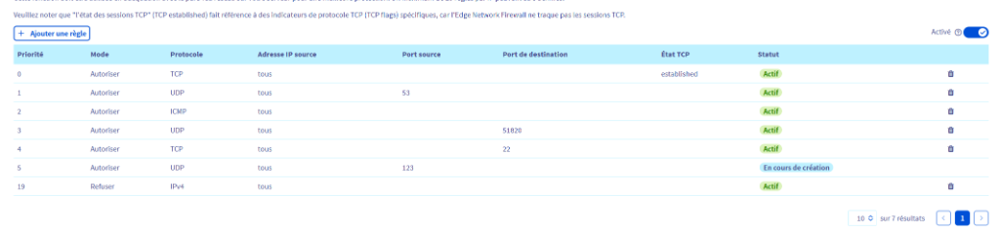

# Configuration du Pare-feu Réseau OVH

Avant même d'atteindre le serveur Proxmox, nous utilisons le **Network Firewall** d'OVH pour filtrer le trafic en amont. C'est une première ligne de défense cruciale.

## Règles du Pare-feu

La stratégie est stricte : **Tout refuser par défaut**, sauf le trafic explicitement nécessaire (WireGuard, DNS, ICMP).

| Priorité | Action | Protocole | Source | Port Dest. | Explication |
| :--- | :--- | :--- | :--- | :--- | :--- |
| **0** | `Autoriser` | TCP | Tout | - | **Vital** : Option "Established" cochée. Permet le retour du trafic initié par le serveur (ex: apt update). |
| **1** | `Autoriser` | UDP | Tout | - | **Vital** pour le DNS (Source Port 53). Autorise les réponses des serveurs DNS. |
| **2** | `Autoriser` | ICMP | Tout | - | Autorise le Ping (pratique pour le monitoring/test). |
| **3** | `Autoriser` | UDP | Tout | `51820` | **WireGuard**. La seule porte d'entrée pour l'administration. |
| **4** | `Autoriser` | TCP | Tout | `22` | **Secours SSH**. À désactiver/supprimer une fois le VPN validé. |
| **5** | `Autoriser` | UDP | Tout (Source Port 123) | - | **NTP**. Synchronisation horaire (Vital pour Talos/K8s). |
| **19** | `Refuser` | IPv4 | Tout | - | **Bloque tout le reste** (Port 8006 Proxmox, Port 80, Scanners, etc.). |

## Notes Importantes

- **Priorité 0 (Established)** : Sans cette règle, le serveur ne peut pas recevoir de réponses à ses propres requêtes (téléchargement d'ISO, mises à jour, etc.).
- **WireGuard (Port 51820)** : C'est le seul service exposé publiquement en permanence. L'interface Proxmox (8006) n'est **pas** exposée.
- **Port 22** : Gardez cette règle pendant l'installation, mais pensez à la désactiver ensuite pour ne laisser que WireGuard.

> [!WARNING]
> **Limitation IPv4 et Nécessité d'iptables local**
>
> Le "Network Firewall" d'OVH **ne s'applique qu'au trafic IPv4**. Le trafic IPv6 traverse ce pare-feu sans être filtré.
>
> Il est donc **indispensable** de configurer un pare-feu local sur le serveur Proxmox (via `iptables` / `ip6tables` ou le Pare-feu du Datacenter Proxmox) pour :
> 1. Sécuriser le trafic IPv6 (ou désactiver IPv6 si non utilisé).
> 2. Apporter une seconde couche de sécurité en cas de mauvaise configuration du pare-feu OVH.

